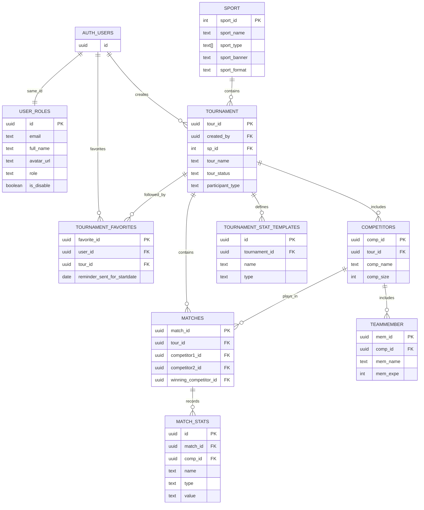

# Database Documentation

This document describes the schema and database architecture for the **Netcompany Tournament Organizer Tool** hosted on Supabase PostgreSQL.

The baseline schema is fully declared in [supabase/migrations/20260915000100_init_tournament_schema.sql](../supabase/migrations/20260915000100_init_tournament_schema.sql), and initial sport catalog data is provided via [supabase/seed.sql](../supabase/seed.sql) and [supabase/migrations/20260916000200_seed_sports_catalog.sql](../supabase/migrations/20260916000200_seed_sports_catalog.sql).

---

## Database Architecture

The application uses PostgreSQL on Supabase for both transactional application data and authentication/session infrastructure. The backend connects directly to Postgres with the `pg` connection pool and validates Supabase Auth access tokens by calling Supabase Auth over HTTP before authorizing requests.

Key responsibilities:

- **Supabase Auth** handles Google/Facebook OAuth and session validation.
- The app stores profile metadata in `public.user_roles`, keyed by the same UUID as `auth.users.id`.
- Application data lives in the `public` schema: tournaments, sports, competitors, matches, favorites, and stat templates.
- Storage is used for public tournament banners and user avatars in Supabase Storage buckets.
- Authorization is intentionally enforced in both the backend application logic and the database through Row Level Security (RLS) policies and security triggers.

---

## ER Diagram



---

## Tables

### `public.user_roles`

Application profile table for authenticated users. The primary key `id` matches `auth.users.id`.

| Column | Type | Nullable | Default | Description |
| --- | --- | --- | --- | --- |
| `id` | `uuid` | No | — | Primary key; matches `auth.users.id` |
| `email` | `text` | No | — | User email |
| `full_name` | `text` | Yes | — | UI-visible profile name |
| `avatar_url` | `text` | Yes | — | URL to avatar image in Storage |
| `role` | `text` | No | `'user'` | Role: `user`, `admin`, `super_admin`, `superadmin` |
| `is_disable` | `boolean` | No | `false` | Blocks API access when true |
| `created_at` | `timestamptz` | No | `now()` | Row creation time |
| `updated_at` | `timestamptz` | No | `now()` | Last update time |

- **Primary key:** `id`
- **Foreign keys:** `id -> auth.users(id) ON DELETE CASCADE`
- **Unique constraints:** PK
- **Indexes:** `idx_user_roles_role` (`role`), `idx_user_roles_email` (`email`)
- **Triggers:** `prevent_user_role_abuse` prevents users from changing their own `role` or `is_disable` flag, and restricts manual role creation to Super Admins.
- **Signup automation:** `handle_new_auth_user()` on `auth.users` automatically provisions a `public.user_roles` row with role `'user'` upon signup.

### `public.sport`

Catalog of supported sports and default rules (IDs 1–12).

| Column | Type | Nullable | Default | Description |
| --- | --- | --- | --- | --- |
| `sport_id` | `integer` | No | — | PK; maps to supported sport IDs (1–12) |
| `sport_name` | `text` | No | — | Display name (e.g. Football, Basketball, TFT) |
| `sport_type` | `text[]` | No | `'{}'` | Supported participant types (`individual`, `team`) |
| `sport_banner` | `text` | Yes | — | Featured banner image URL |
| `sport_format` | `text` | Yes | — | Default tournament format |
| `created_at` | `timestamptz` | No | `now()` | Creation time |
| `updated_at` | `timestamptz` | No | `now()` | Update time |

- **Primary key:** `sport_id`
- **Seeded data:** Prepopulated via `supabase/seed.sql` and migration `20260916000200_seed_sports_catalog.sql`.

### `public.tournament`

Competition record for an organized tournament.

| Column | Type | Nullable | Default | Description |
| --- | --- | --- | --- | --- |
| `tour_id` | `uuid` | No | `gen_random_uuid()` | Primary key |
| `tour_name` | `text` | Yes | — | Name |
| `tour_descrip` | `text` | Yes | — | Description |
| `tour_locat` | `text` | Yes | — | Location |
| `tour_startdate` | `date` | Yes | — | Tournament start date |
| `tour_enddate` | `date` | Yes | — | Tournament end date |
| `tour_banner` | `text` | Yes | — | Public banner URL |
| `tour_status` | `text` | No | `'draft'` | `draft`, `ongoing`, `paused`, `ended`, `completed`, `cancelled`, `archived` |
| `created_by` | `uuid` | No | — | Organizer `auth.users.id` |
| `sp_id` | `integer` | Yes | — | Sport reference |
| `participant_type` | `text` | Yes | — | `individual` or `team` |
| `tour_format` | `text` | Yes | — | Format (single/double elimination, round_robin, round_scoring, hybrid) |
| `group_count` | `integer` | Yes | — | Grouping configuration |
| `advance_per_group` | `integer` | Yes | — | Hybrid/round-robin progression |
| `first_stage_format` | `text` | Yes | — | Stage 1 format |
| `second_stage_format` | `text` | Yes | — | Stage 2 format |
| `sets_per_match` | `integer` | No | `1` | Sets per match |
| `tour_pausedate` | `timestamptz` | Yes | — | Pause timestamp |
| `created_at` | `timestamptz` | No | `now()` | Row creation |
| `updated_at` | `timestamptz` | No | `now()` | Last update |

- **Primary key:** `tour_id`
- **Foreign keys:** `created_by -> auth.users(id) ON DELETE CASCADE`, `sp_id -> public.sport(sport_id) ON DELETE SET NULL`
- **Indexes:** `idx_tournament_created_by`, `idx_tournament_sp_id`, `idx_tournament_status`, `idx_tournament_startdate`
- **Triggers:** `prevent_tournament_ownership_forgery` ensures only the owner or a Super Admin may alter `created_by`.

### `public.competitors`

A participant unit for a tournament (team or single entrant).

| Column | Type | Nullable | Default | Description |
| --- | --- | --- | --- | --- |
| `comp_id` | `uuid` | No | `gen_random_uuid()` | Primary key |
| `tour_id` | `uuid` | No | — | Tournament this competitor belongs to |
| `comp_name` | `text` | No | — | Display name |
| `comp_logo` | `text` | Yes | — | Optional logo URL |
| `comp_size` | `integer` | No | `1` | 1 for individuals; >1 for teams |
| `created_at` | `timestamptz` | No | `now()` | Creation time |
| `updated_at` | `timestamptz` | No | `now()` | Update time |

- **Primary key:** `comp_id`
- **Foreign keys:** `tour_id -> public.tournament(tour_id) ON DELETE CASCADE`
- **Indexes:** `idx_competitors_tour_id`

### `public.teammember`

Roster entries for each competitor; stores team member names and experience.

| Column | Type | Nullable | Default | Description |
| --- | --- | --- | --- | --- |
| `mem_id` | `uuid` | No | `gen_random_uuid()` | Primary key |
| `comp_id` | `uuid` | No | — | Competitor parent |
| `mem_name` | `text` | No | — | Member display name |
| `mem_expe` | `integer` | Yes | — | Optional experience level/score |
| `created_at` | `timestamptz` | No | `now()` | Creation time |
| `updated_at` | `timestamptz` | No | `now()` | Update time |

- **Primary key:** `mem_id`
- **Foreign keys:** `comp_id -> public.competitors(comp_id) ON DELETE CASCADE`
- **Indexes:** `idx_teammember_comp_id`

### `public.matches`

Bracket / match record generated by bracket generation logic.

| Column | Type | Nullable | Default | Description |
| --- | --- | --- | --- | --- |
| `match_id` | `uuid` | No | `gen_random_uuid()` | Primary key |
| `tour_id` | `uuid` | No | — | Parent tournament |
| `round` | `integer` | Yes | — | Round number |
| `stage` | `text` | Yes | — | Stage name |
| `group_name` | `text` | Yes | — | Group name |
| `status` | `text` | No | `'locked'` | `locked`, `ready`, `waiting`, `running`, `paused`, `completed`, `resolved`, `archived`, `bye` |
| `scheduled_start` | `timestamptz` | Yes | — | Scheduled start |
| `scheduled_end` | `timestamptz` | Yes | — | Scheduled end |
| `elapsed_ms` | `bigint` | No | `0` | Elapsed match time in ms |
| `running_since` | `timestamptz` | Yes | — | Start of current run |
| `tour_pausedate` | `timestamptz` | Yes | — | Pause timestamp |
| `competitor1_id` | `uuid` | Yes | — | First competitor |
| `competitor2_id` | `uuid` | Yes | — | Second competitor |
| `score1` | `numeric` | Yes | — | Score for competitor 1 |
| `score2` | `numeric` | Yes | — | Score for competitor 2 |
| `winning_competitor_id` | `uuid` | Yes | — | Winner when resolved |
| `result1` | `text` | Yes | — | Result label for competitor 1 |
| `result2` | `text` | Yes | — | Result label for competitor 2 |
| `is_draw` | `boolean` | No | `false` | Draw flag |
| `next_winner_match_id` | `uuid` | Yes | — | Winner bracket advancement |
| `next_loser_match_id` | `uuid` | Yes | — | Loser bracket advancement |
| `round_scores` | `jsonb` | Yes | — | Score payload for round-scoring formats |
| `created_at` | `timestamptz` | No | `now()` | Creation time |
| `updated_at` | `timestamptz` | No | `now()` | Update time |

- **Primary key:** `match_id`
- **Foreign keys:**
  - `tour_id -> public.tournament(tour_id) ON DELETE CASCADE`
  - `competitor1_id -> public.competitors(comp_id) ON DELETE SET NULL`
  - `competitor2_id -> public.competitors(comp_id) ON DELETE SET NULL`
  - `winning_competitor_id -> public.competitors(comp_id) ON DELETE SET NULL`
  - `next_winner_match_id -> public.matches(match_id) ON DELETE SET NULL`
  - `next_loser_match_id -> public.matches(match_id) ON DELETE SET NULL`
- **Indexes:** `idx_matches_tour_id`, `idx_matches_competitor1`, `idx_matches_competitor2`, `idx_matches_winner`, `idx_matches_stage_round`

### `public.tournament_stat_templates`

Reusable custom stat definitions for a tournament.

| Column | Type | Nullable | Default | Description |
| --- | --- | --- | --- | --- |
| `id` | `uuid` | No | `gen_random_uuid()` | Primary key |
| `tournament_id` | `uuid` | No | — | Tournament owner |
| `name` | `text` | No | — | Stat name |
| `type` | `text` | No | — | `INTEGER`, `PERCENTAGE`, `TEXT`, `DURATION`, `BOOLEAN` |
| `created_at` | `timestamptz` | No | `now()` | Creation time |

- **Primary key:** `id`
- **Foreign keys:** `tournament_id -> public.tournament(tour_id) ON DELETE CASCADE`
- **Unique constraints:** `(tournament_id, name)`
- **Indexes:** `idx_tournament_stat_templates_tournament_id`

### `public.match_stats`

Dynamic score and stat values recorded per match.

| Column | Type | Nullable | Default | Description |
| --- | --- | --- | --- | --- |
| `id` | `uuid` | No | `gen_random_uuid()` | Primary key |
| `match_id` | `uuid` | No | — | Parent match |
| `name` | `text` | No | — | Stat name |
| `type` | `text` | Yes | — | Stat type (`INTEGER`, `PERCENTAGE`, `TEXT`, `DURATION`, `BOOLEAN`) |
| `value` | `text` | Yes | — | Stored stat value |
| `comp_id` | `uuid` | Yes | — | Optional competitor association |
| `created_at` | `timestamptz` | No | `now()` | Creation time |

- **Primary key:** `id`
- **Foreign keys:**
  - `match_id -> public.matches(match_id) ON DELETE CASCADE`
  - `comp_id -> public.competitors(comp_id) ON DELETE SET NULL`
- **Indexes:** `idx_match_stats_match_id`, `idx_match_stats_comp_id`

### `public.tournament_favorites`

Follow list and email reminder tracking for signed-in users.

| Column | Type | Nullable | Default | Description |
| --- | --- | --- | --- | --- |
| `favorite_id` | `uuid` | No | `gen_random_uuid()` | Primary key |
| `user_id` | `uuid` | No | — | User who favorited the tournament |
| `tour_id` | `uuid` | No | — | Tournament favorited |
| `created_at` | `timestamptz` | No | `now()` | Favorite timestamp |
| `updated_at` | `timestamptz` | No | `now()` | Last update |
| `reminder_sent_for_startdate` | `date` | Yes | — | Date reminder was sent |
| `reminder_claimed_for_startdate` | `date` | Yes | — | Date reminder was claimed by scheduler |
| `reminder_claimed_at` | `timestamptz` | Yes | — | Claim timestamp |
| `reminder_sent_at` | `timestamptz` | Yes | — | Send timestamp |

- **Primary key:** `favorite_id`
- **Foreign keys:**
  - `user_id -> auth.users(id) ON DELETE CASCADE`
  - `tour_id -> public.tournament(tour_id) ON DELETE CASCADE`
- **Unique constraints:** `(user_id, tour_id)`
- **Indexes:** `idx_tournament_favorites_tour_id`, `idx_tournament_favorites_user_id`

---

## Authentication & Authorization

Authentication is provided by Supabase Auth (Google and Facebook OAuth). The Node.js backend verifies bearer tokens with Supabase Auth HTTP endpoint `GET /auth/v1/user` using the anonymous key, and loads the corresponding `public.user_roles` record.

### Row Level Security (RLS)

All tables have RLS enabled:

- **Public access:**
  - `public.sport`: Read-only for all clients.
  - `public.tournament`: Guests can SELECT non-draft tournaments (`tour_status != 'draft'`).
  - `public.competitors`, `public.teammember`, `public.matches`: Readable if the parent tournament is not in `draft`.
- **Tournament Admin / Owner:**
  - Can manage (INSERT/UPDATE/DELETE) tournaments where `created_by = auth.uid()`.
  - Can manage competitors, team members, matches, and stats belonging to their tournaments.
- **Super Admin:**
  - Bypasses ownership checks for all tables via role check `lower(role) IN ('super_admin', 'superadmin')`.
  - Only role authorized to access `public.user_roles` admin mutations (disable, enable, promote, demote).

---

## Storage Buckets

Two public buckets are configured in `storage.buckets`:

1. **`avatars`**:
   - Stores user profile avatars under path `{userId}/avatar_...`.
   - Public read access for all users.
   - Upload/update/delete restricted to authenticated users writing to their own user folder (`(storage.foldername(name))[1] = auth.uid()::text`).
2. **`tournament-banners`**:
   - Stores tournament banners and custom competitor logos.
   - Public read access.
   - Authenticated upload restricted to image extensions (`jpg`, `jpeg`, `png`, `webp`, `gif`).

---

## Running Database Setup

1. **With Hosted Supabase (recommended):**
   Apply migrations sequentially using the Supabase CLI or SQL Editor:
   - Run `supabase/migrations/20260915000100_init_tournament_schema.sql` (schema, triggers, RLS, storage).
   - Run `supabase/migrations/20260916000200_seed_sports_catalog.sql` (sports 1–12).
2. **With Local Supabase CLI:**
   ```bash
   supabase start
   supabase db reset
   ```
   `supabase/config.toml` will automatically run all migrations in `supabase/migrations/` and apply `supabase/seed.sql`.
