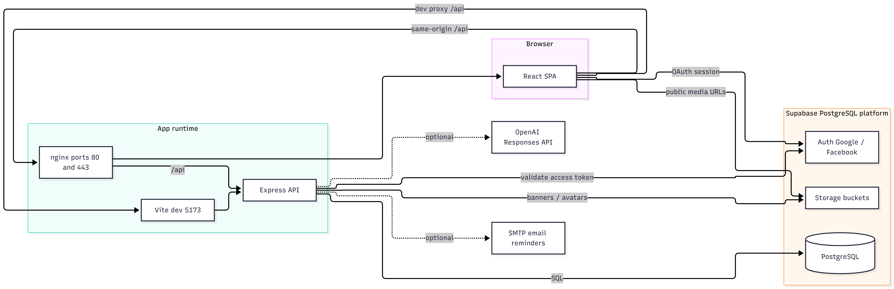
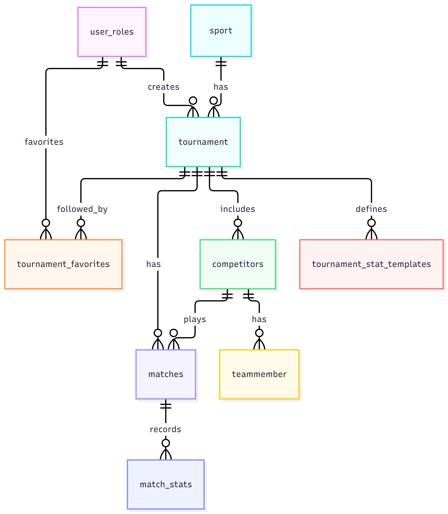
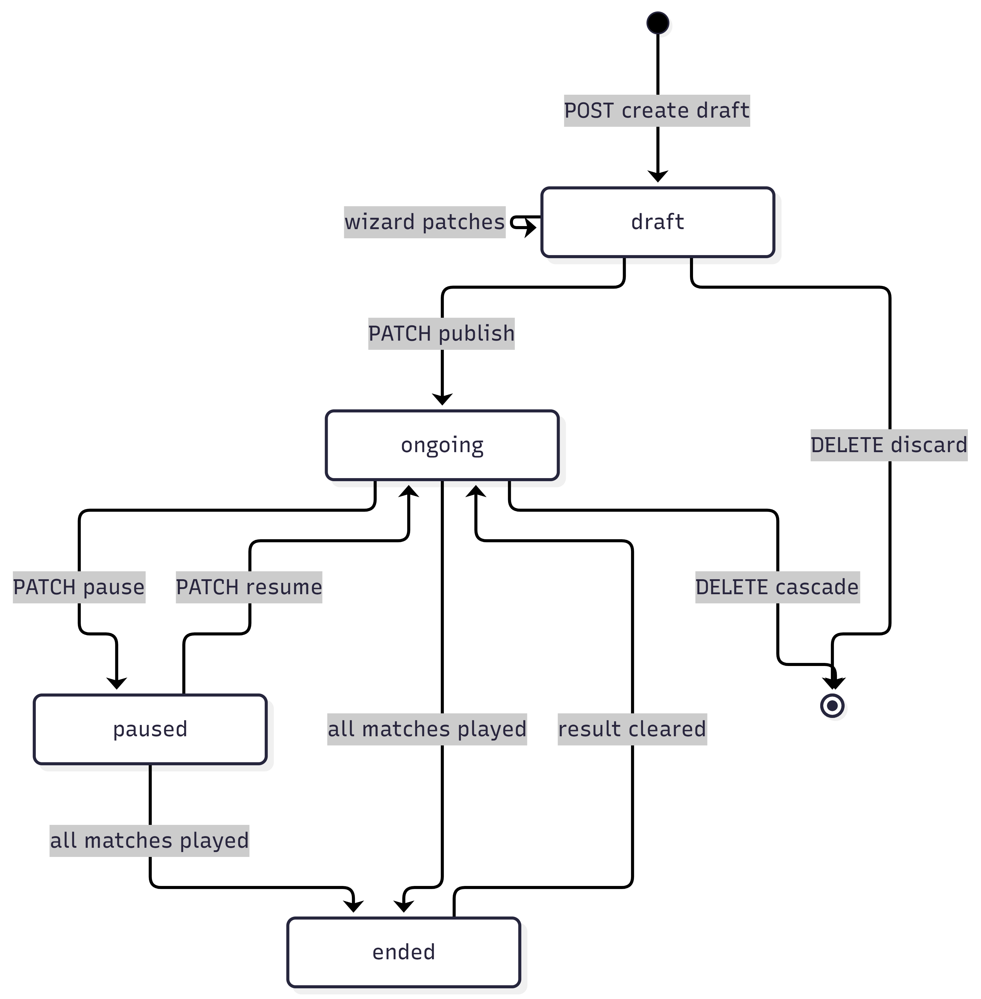
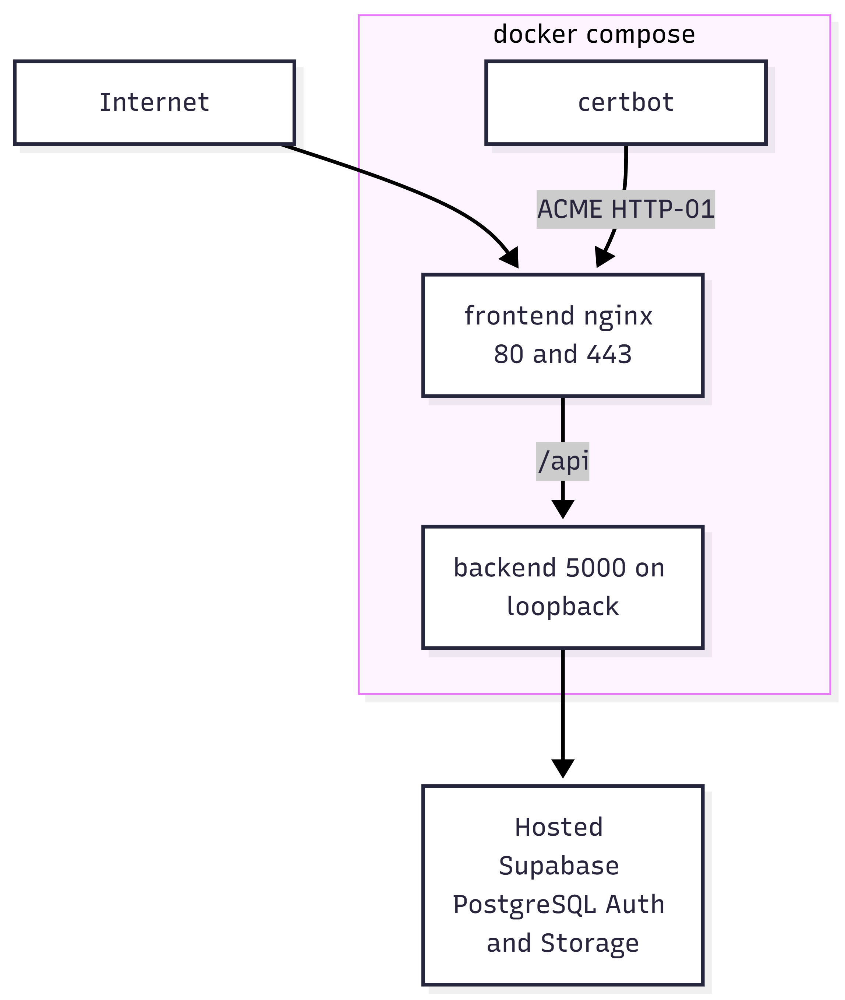

# Netcompany Tournament Organizer Tool — Technical document

This is the technical handover for the **Netcompany Tournament Organizer Tool** (web). It is written for a receiving engineering team and for stakeholders who already know the capstone scope.
Start with the root [README](../README.md) to run the project. Use this file to understand architecture, roles, APIs, and operations. Complete schema and RLS documentation is in **[docs/DATABASE.md](DATABASE.md)**.

---

## Table of contents

1. [Document purpose](#1-document-purpose)
2. [Project context](#2-project-context)
3. [Objectives and scope](#3-objectives-and-scope)
4. [Deliverables vs what was built](#4-deliverables-vs-what-was-built)
5. [System overview](#5-system-overview)
6. [Architecture](#6-architecture)
7. [Tech stack](#7-tech-stack)
8. [Repository map](#8-repository-map)
9. [Roles and access control](#9-roles-and-access-control)
10. [Authentication](#10-authentication)
11. [Domain model](#11-domain-model)
12. [Tournament lifecycle](#12-tournament-lifecycle)
13. [Sports, formats, and rankings](#13-sports-formats-and-rankings)
14. [HTTP API](#14-http-api)
15. [Frontend routes](#15-frontend-routes)
16. [Environment variables](#16-environment-variables)
17. [Local development](#17-local-development)
18. [Deployment](#18-deployment)
19. [Email reminders](#19-email-reminders)
20. [Admin AI advisor](#20-admin-ai-advisor)
21. [Database and Supabase](#21-database-and-supabase)
22. [Testing](#22-testing)
23. [Known limitations](#23-known-limitations)
24. [Where to change what](#24-where-to-change-what)

---

## 1. Document purpose

This document covers:

- What the product is, against the official scope
- How the running system is structured (SPA + Express API + PostgreSQL on Supabase)
- How to configure, run, and deploy it
- Where business rules live in the source

It is **not** an end-user manual. Admin and public behaviour is described only as far as a tech team needs to operate and extend the code.

---

## 2. Project context

| Field | Value |
| --- | --- |
| Official name | Netcompany Tournament Organizer Tool (Web) |
| Repository folder | `tournament-organizer` |
| Stakeholders | Capstone students, academic supervisors, Netcompany (industrial partner) |
| Planned timeline | May 2026 – October 2026 (6 months) |
| Capstone team | Le Chanh Tri, Nguyen Vu Duy, To Nhat Duy, Tran Quang, Huynh Nhat Anh |
| Scope themes | Tournament software, web development, cloud/systems |

The platform is a centralized web tool for Netcompany to **configure, schedule, manage, and monitor** sports and esports tournaments: brackets, live results, rankings, calendars, and a responsive admin dashboard.

---

## 3. Objectives and scope

### 3.1 Objectives (from the scope document)

The platform supports multiple sports from one administrative interface:

- Configure, create, edit, and manage tournaments
- Configure structures, schedules, and event timings
- Automatically generate team pairings and tournament brackets
- Display live results, rankings, and historical match records
- Provide secure authentication and account management
- Provide dashboard analytics and sport-specific pages

### 3.2 In scope (core)

- Tournament configuration and management for administrators
- Automatic team formation and match pairing
- Tournament calendar, schedules, and result tracking
- General dashboard and sport-specific pages
- Google and Facebook login
- Role-based access: Super Admin, Admin, User, Guest
- Responsive UI for desktop and mobile **browsers**

### 3.3 Out of scope (not built, by design)

| Out of scope | How the product treats it |
| --- | --- |
| Native mobile apps | Responsive SPA only |
| Advanced cybersecurity / penetration testing | Standard auth and HTTPS in deploy; no pentest deliverable |
| Self-registration of **external tournament participants** | Admins enter teams/players in the wizard. There is no public “join this tournament” signup |
| More than **two stages** in one tournament cycle | Hybrid format is stage 1 then stage 2 only |
| **Livestream** (Facebook Graph API) | Dropped after client negotiation. Do not implement or treat as a missing deliverable |
| **Animation** (match/bracket motion graphics and similar) | Dropped after client negotiation. The UI is static/responsive CSS; there is no animation feature to hand over |

### 3.4 Admin AI advisor

Optional supporting feature, **implemented**. Admins and Super Admins get a chat widget on every `/admin/*` page. It suggests formats and participant setups only — it does not fill the wizard or create tournaments. Wire format is the **OpenAI Responses API** (see [§20](#20-admin-ai-advisor)).

---

## 4. Deliverables vs what was built

| Scope deliverable | Status | Notes |
| --- | --- | --- |
| Core functional website | Delivered | Public sports, tournaments, matches, calendar |
| Admin configuration pages | Delivered | 4-step wizard, edit, match ops, stat templates |
| Tournament dashboard | Delivered | Admin analytics dashboard; public tournament/sport pages show schedules and rankings |
| Authentication module | Delivered | Google and Facebook OAuth via Supabase Auth |
| Database (PostgreSQL) | Delivered | PostgreSQL **hosted on Supabase**, which also provides Auth and Storage |
| Email reminder system | Delivered | Nodemailer; optional until SMTP is configured |
| User features (login, favorites, notifications) | Delivered | OAuth login (first login creates the account). Favorites + **email** reminders. In-app notification list is a placeholder |
| Source code repository | Delivered | This git repo |
| Documentation | Delivered | README + this file |
| AI advisor | Delivered | Admin-only; OpenAI Responses API; suggestions only |

Livestream and animation were **removed by agreement** with the client. They are not deliverables.

**“Registration”** here means: a person signs in with Google/Facebook and gets a User account. It does **not** mean email/password signup, and it does not mean players registering themselves into a tournament (explicitly out of scope).

---

## 5. System overview

One **React single-page app** and one **Express REST API**. Guests and signed-in users share the public site. Admins use `/admin/*` on the same SPA. The client hides admin screens by role; the API enforces the same rules.

| Audience | Capabilities |
| --- | --- |
| **Guest** (not signed in) | Browse sports, published tournaments, brackets/standings, match details, calendar. Cannot favorite or edit profile |
| **User** | Everything a guest can do, plus OAuth session, profile/avatar, favorite tournaments, email reminders |
| **Admin** | Everything a user can do, plus dashboard, create/configure/run **their own** tournaments, generate brackets, schedule and score matches, pause/resume, stat templates, AI creation advisor |
| **Super Admin** | Everything an admin can do, **plus** account management (promote, demote, disable, enable) and the ability to **modify any tournament**, regardless of who created it |

Sports in the catalog (IDs 1–12): football, basketball, badminton, ping pong, running, bowling, League of Legends, Valorant, Dota 2, Counter-Strike 2, Teamfight Tactics, programming contests.

Formats: single elimination, double elimination, round robin, round scoring, hybrid (at most two stages).

---

## 6. Architecture

The scope called for a client–server system: React frontend, Express APIs, PostgreSQL, Docker. That is what was built. PostgreSQL, login, and file uploads are provided by a **hosted Supabase** project (Postgres + Auth + Storage) rather than a self-managed Postgres-only server.



**Production request path**

1. nginx serves the built SPA (`try_files` → `index.html` for client routing).
2. Browser calls **same origin** `/api/...`. nginx proxies `/api/` to the backend container (`backend:5000`).
3. The SPA talks to Supabase Auth for login and session.
4. Protected API routes send `Authorization: Bearer <access_token>`. The backend validates the token with Supabase Auth, then loads `public.user_roles`.

**Local npm path**

- Frontend: Vite **5173**
- Backend: Express **5001**
- Vite proxies `/api` → `http://localhost:5001`
- Leave `VITE_API_BASE_URL` unset so Axios stays on relative `/api`

The SPA is not trusted. `AdminRoute` only hides UI. Mutations are checked again on the server.

---

## 7. Tech stack

| Layer | As built |
| --- | --- |
| Frontend | React 19, React Router 7, Vite 8, Tailwind CSS 4, Axios, Font Awesome |
| Backend | Node.js 22, Express 5, CommonJS |
| Database | PostgreSQL via `pg` pool, hosted on Supabase |
| Auth | Supabase Auth (Google, Facebook) |
| Files | Supabase Storage (`tournament-banners`, `avatars`) |
| Brackets | `brackets-manager` (server); `react-tournament-brackets` (UI) |
| Email | Nodemailer |
| Containers | Docker Compose, nginx, certbot |
| AI | OpenAI **Responses** API (`POST {AI_BASE_URL}/responses`). Current env uses a compatible gateway (`https://modelapi.vn/v1`). Official OpenAI is the same protocol with a different base URL |

No ORM. SQL lives in repositories. JSON body limit on the API is **5 MB** (inline image uploads).

---

## 8. Repository map

```
tournament-organizer/
├── frontend/                 React SPA
│   ├── src/pages/            Public, auth, admin screens
│   ├── src/components/       UI by area (layout, tournament_*, match_*, dashboard, …)
│   ├── src/services/         Axios API wrappers
│   ├── src/context/          AuthProvider
│   └── nginx*.conf           Production reverse proxy + TLS
├── backend/
│   ├── index.js              Express app, route mounts, reminder scheduler
│   ├── src/modules/          user, tournament, matches, sport, admin, favorites
│   ├── src/shared/           DB pool, auth middleware, AppError
│   └── tests/                Node unit tests
├── supabase/                 Baseline SQL schema + sports catalog seed
├── env/modes/                local vs deploy port/URL switcher
├── docker-compose.yml
├── docs/                     TECHNICAL.md, DATABASE.md
└── Netcompany_Capstone_Project_ScopeAndDelivevrable_Document.pdf
```

Typical backend module: `routes → controller → service → repository`, with `dto` files for input validation. Services throw `AppError`; `errorHandler` returns `{ error: { message } }` with the HTTP status. Unexpected errors become 500 `"Internal server error."`

---

## 9. Roles and access control

Four **product** roles. Only three are stored in the database; Guest is “no session”.

| Product role | Stored as | UI |
| --- | --- | --- |
| Guest | — | Public pages only |
| User | `user` | Public site + account page |
| Admin | `admin` | `/admin/*` except Accounts |
| Super Admin | `super_admin` or `superadmin` | All admin pages including Accounts |

Frontend normalizes roles to `USER` / `ADMIN` / `SUPER_ADMIN`.

### 9.1 Super Admin vs Admin (as built)

**Admin** can:

- Use the admin dashboard, wizard, tournament list, match operations, stat templates, pause/resume, AI advisor
- Create and manage **only tournaments they created** (`created_by` = themselves)

**Super Admin** can do all of that, and additionally:

- Open **Accounts Management** (`/admin/accounts`): promote to admin, demote to user, disable, enable
- **Edit, discard, or delete any tournament**, including ones created by other admins

The accounts sidebar item is hidden unless `isSuperAdmin`. The route `/admin/accounts` is wrapped in `AdminRoute` with `allowedRoles={['SUPER_ADMIN']}`. Account-management APIs use `requireSuperAdminUser` and `assertSuperAdmin` (list, disable, enable, promote, demote).

Tournament SQL uses:

```sql
created_by = $organizerId
OR EXISTS (
  SELECT 1 FROM public.user_roles
  WHERE id = $organizerId AND role IN ('superadmin', 'super_admin')
)
```

Regular `admin` is **not** in that `IN` list; they rely on `created_by`.

### 9.2 Implementation note for maintainers

Product rule: user management is Super Admin only. The UI and the `/api/users/admin/*` routes both enforce that (`requireSuperAdminUser` plus `assertSuperAdmin` in the service).

Users cannot disable or demote themselves. Only a Super Admin can disable or enable **admin** accounts.

---

## 10. Authentication

### Login

`frontend/src/pages/auth/Login.jsx` starts Supabase OAuth (`google` or `facebook`) with `redirectTo: {origin}/oauth/callback`.

`OAuthCallbackPage` exchanges the `code` for a session, loads `/api/users/me/profile`, then routes:

- Admin / Super Admin → `/admin/dashboard`
- User → `/`

If `user_roles.is_disable` is true, the API returns **403**; the client signs out locally and returns to login with an error query string.

Supabase Auth URL Configuration (**Authentication** → **URL Configuration** in the Supabase Dashboard):

- **Site URL**:
  - Development: `http://localhost:5173`
  - Production: `https://<YOUR_EC2_PUBLIC_IP>` or `https://your-domain.com`
- **Redirect URLs (Allow-list)**:
  - Local development: `http://localhost:5173/oauth/callback`, `http://localhost:5173/**`, `http://127.0.0.1:5173/oauth/callback`
  - Production origin: `https://<YOUR_EC2_PUBLIC_IP>/oauth/callback`, `https://<YOUR_EC2_PUBLIC_IP>/**`
- For local Supabase CLI (`supabase start`), configure `site_url` and `additional_redirect_urls` in `supabase/config.toml`. See [docs/DATABASE.md](DATABASE.md#supabase-auth-url--redirect-configuration) for full details.

### API token check

`backend/src/shared/middleware/authenticateSupabaseUser.js`:

1. Read `Authorization: Bearer …`
2. `GET {SUPABASE_URL}/auth/v1/user` with the anon key and that token
3. Load `user_roles` by Auth user id
4. Reject missing/invalid token or disabled account

There is no local JWT secret verification. Each protected request calls Supabase Auth over HTTP.

`requireAdminUser` allows `admin`, `super_admin`, `superadmin` (case-insensitive). `requireSuperAdminUser` allows only `super_admin` / `superadmin`.

### CORS

`app.use(cors())` with no origin allow-list. Behind same-origin nginx this is usually unused. Tighten it if the API is ever hosted on another origin.

---

## 11. Domain model

The complete database schema is versioned in [`supabase/migrations/20260915000100_init_tournament_schema.sql`](../supabase/migrations/20260915000100_init_tournament_schema.sql) and documented in detail in [docs/DATABASE.md](DATABASE.md). The initial 12 sports are seeded via [`supabase/seed.sql`](../supabase/seed.sql) and [`supabase/migrations/20260916000200_seed_sports_catalog.sql`](../supabase/migrations/20260916000200_seed_sports_catalog.sql).



### `public.user_roles`

Application profile; `id` equals `auth.users.id`.

| Column | Notes |
| --- | --- |
| `email`, `full_name`, `avatar_url` | Profile |
| `role` | `user` / `admin` / `super_admin` |
| `is_disable` | Blocks API authentication |

`auth.identities` is joined to expose OAuth `providers` on the profile DTO.

### `public.sport`

Catalog `sport_id` 1–12: `sport_name`, `sport_type[]`, `sport_banner`, `sport_format`. **Enforced** format rules live in `backend/src/modules/tournament/config/sportRules.config.js`. Keep IDs aligned with `frontend/src/constants/sports.js`.

### `public.tournament`

| Column | Notes |
| --- | --- |
| `tour_id` | UUID PK |
| `tour_name`, `tour_descrip`, `tour_locat` | Wizard step 1 |
| `tour_startdate`, `tour_enddate` | Pause/resume may shift these |
| `tour_banner` | Public Storage URL |
| `tour_status` | See [§12](#12-tournament-lifecycle) |
| `created_by` | Organizing admin |
| `sp_id` | Sport |
| `participant_type` | `individual` or `team` |
| `tour_format` | See [§13](#13-sports-formats-and-rankings) |
| `group_count`, `advance_per_group` | Groups / hybrid |
| `first_stage_format`, `second_stage_format` | Hybrid (max two stages) |
| `sets_per_match` | Round scoring |
| `tour_pausedate` | While paused |

### `public.competitors` / `public.teammember`

A **competitor** is the competitive unit (team or single player). `comp_size` is 1 for individuals. `comp_logo` stores the public logo URL (preset or uploaded to `tournament-banners`). Members live in `teammember` (`mem_name`, `mem_expe`). Individuals also get a teammember row with the same display name.

### `public.matches`

Generated by bracket services: `round`, `stage`, `group_name`, competitors, scores, `winning_competitor_id`, `is_draw`, `result1` / `result2`, `status`, `scheduled_start` / `scheduled_end`, `next_winner_match_id` / `next_loser_match_id`.

Match statuses used in code include: `locked`, `ready`, `running`, `paused`, `completed`, `resolved`, `archived`, `bye`.

### `public.tournament_stat_templates` / `public.match_stats`

Named stats per tournament (`INTEGER`, `PERCENTAGE`, `TEXT`, `DURATION`, `BOOLEAN`). New matches can be bootstrapped from templates.

### `public.tournament_favorites`

Follow list plus reminder claim/sent columns. RLS is on with **no client policies**, so the browser cannot read this table through the Supabase API; only the backend database user can.

---

## 12. Tournament lifecycle



**Create wizard** (`/admin/tournaments/create`) — four steps, matching the admin-configuration deliverable:

1. **General details** — `POST /api/tournaments`, optional `PATCH /:id/general-details`. Banner is a preset public URL or a `data:` image uploaded to Storage.
2. **Sport & participants** — `PATCH /:id/sport-participants`. Replaces competitors each save. Participants can be entered manually or uploaded in bulk via **CSV** ([`sample_players.csv`](../sample_players.csv) or [`sample_players_16.csv`](../sample_players_16.csv)). Format: `Name,Experience` where experience is one of `Beginner`, `Intermediate`, `Advanced`, or `Expert`. Teams may be predefined with custom/default logos (uploaded to `tournament-banners` bucket) or **randomly grouped** (`buildRandomizedTeamParticipants`) — satisfying the automatic team-formation requirement.
3. **Format** — `PATCH /:id/format-config`, validated against `sportRules.config.js`.
4. **Review & publish** — `GET /:id/review`, then `PATCH /:id/publish` sets `tour_status` to **`ongoing`**.

Leaving the wizard may `DELETE /:id/discard`. Discard deletes **drafts only**. Live events use cascade `DELETE /:id` (admin action modal), not discard.

**After publish**

- `/admin/tournaments/:id/matches` → `POST /:id/generate-bracket` (deletes existing matches, then inserts a new set — automatic pairing). The API does not itself require `ongoing` status.
- Scoring `PATCH /api/matches/:matchId` (and round-scoring / hybrid submit) updates the match and **propagates** winners/losers along `next_*_match_id`. Elimination bracket matches (and non-football sports) strictly forbid draws; a winner must be determined. Hybrid generates stage 2 when stage 1 is complete.
- Scheduling `PATCH /api/matches/:matchId/schedule` validates that match start is not in the past (`< now`), start date is not before `tour_startdate`, and end date does not exceed `tour_enddate`.
- After a score save, `tournamentCompletion.js` sets `tour_status = 'ended'` when **every** match is played (winner, draw, or status `completed` / `resolved` / `archived` / `bye`). Hybrid also requires at least one **stage 2** match, so finishing stage 1 does not end the event. Zero matches does not end it. Clearing a result can revert `ended` to `ongoing`. End date alone does **not** write `ended`; public cards may still show “Ended” from `tour_enddate`. Older rows with `completed` are treated the same as `ended` when reading.
- Pause stores `pause_date` and sets `paused`. Resume requires `resume_date` and shifts start/end dates by the pause length.

Public endpoints hide `draft` rows.

---

## 13. Sports, formats, and rankings

Canonical rules: `backend/src/modules/tournament/config/sportRules.config.js`.  
Also exposed as `GET /api/tournaments/sport-rules`.

| IDs | Sport | Participants | Formats |
| --- | --- | --- | --- |
| 1 | Football | team | elimination, round robin, hybrid (league table 3/1/0) |
| 2 | Basketball | team | same family |
| 3–4 | Badminton, Ping Pong | individual or team | same family |
| 5 | Running | individual | round scoring / hybrid (`score_mode: time`) |
| 6 | Bowling | individual | round scoring / hybrid (`score_mode: points`) |
| 7–10 | LoL, Valorant, Dota 2, CS2 | individual or team | elimination / round robin / hybrid |
| 11 | Teamfight Tactics | individual | round scoring / hybrid; lobby size 8; field must be 8, 16, 32, or 64 |
| 12 | Programming | individual | round scoring / hybrid (`score_mode: points`) |

| Format | Service | Behaviour |
| --- | --- | --- |
| `single_elimination`, `double_elimination`, `round_robin` | `bracketStandard.service.js` | `brackets-manager` |
| `round_scoring` | `bracketRoundScoring.service.js` | Multi-player rounds / lobbies |
| `hybrid` | `bracketHybrid.service.js` | Stage 1 groups, then stage 2 (never a third stage) |

**Rankings** — `GET /api/tournaments/:id/rankings`:

- Round robin → standings
- Round scoring → scores
- Elimination → placement from bracket (byes are not counted as played)
- Hybrid → stage-aware payload

Tests: `backend/tests/rankings.unit.test.js`, `tft_round_scoring.unit.test.js`.

---

## 14. HTTP API

Base path `/api`. Errors: `{ "error": { "message": "..." } }`.  
Protected routes: `Authorization: Bearer <supabase access_token>`.

### Sports — `/api/sports`

| Method | Path | Auth | Description |
| --- | --- | --- | --- |
| GET | `/` | public | All sports |
| GET | `/:sportId` | public | One sport |

### Users — `/api/users`

| Method | Path | Auth | Description |
| --- | --- | --- | --- |
| GET | `/me/profile` | user | Current profile |
| PATCH | `/me/profile` | user | Update `fullName` (max 15 characters) |
| POST | `/me/avatar` | user | Base64 image → `avatars` bucket |
| GET | `/:userId/profile` | public | Profile by id |
| GET | `/admin/profiles` | Super Admin | All users |
| PATCH | `/admin/:userId/disable` | Super Admin | Disable account |
| PATCH | `/admin/:userId/enable` | Super Admin | Enable account |
| PATCH | `/admin/:userId/promote` | Super Admin | `role = admin` |
| PATCH | `/admin/:userId/demote` | Super Admin | `role = user` |

### Tournaments — `/api/tournaments`

Public:

| Method | Path | Description |
| --- | --- | --- |
| GET | `/sport-rules` | Format rules |
| GET | `/public` | Non-draft tournaments; query `sportId` |
| GET | `/:id/public` | Public tournament |
| GET | `/:id/participants` | Competitors and members |
| GET | `/:id/matches` | Matches / bracket |
| GET | `/:id/stages` | Stages |
| GET | `/:id/rankings` | Rankings / standings |

Admin (`auth` + `requireAdminUser`; Super Admin bypasses ownership):

| Method | Path | Description |
| --- | --- | --- |
| GET | `/` | Tournaments this actor may manage |
| POST | `/` | Create draft (step 1) |
| PATCH | `/:id/general-details` | Step 1 |
| PATCH | `/:id/sport-participants` | Step 2 |
| PATCH | `/:id/format-config` | Step 3 |
| GET | `/:id/review` | Step 4 |
| PATCH | `/:id/publish` | Draft → `ongoing` |
| DELETE | `/:id/discard` | Delete draft |
| DELETE | `/:id` | Cascade delete |
| PATCH | `/participants/members/:memId` | Member details |
| PATCH | `/:id/competitors/:compId` | Competitor name/logo |
| POST | `/:id/generate-bracket` | Build/replace matches |
| POST | `/:id/bracket/rounds/:matchId/scores` | Round-scoring submit |
| GET/POST | `/:id/stat-templates` | List / create |
| DELETE | `/:id/stat-templates/:templateId` | Delete template |
| PATCH | `/:id/pause` | `{ pause_date }` |
| PATCH | `/:id/resume` | `{ resume_date }` |

#### Key API Request Payloads

**`PATCH /api/tournaments/:id/sport-participants` (Team Format)**
```json
{
  "sp_id": 1,
  "participant_type": "team",
  "participants": [
    {
      "id": "temp-team-1",
      "name": "Team Tigers",
      "logo": "https://.../storage/v1/object/public/tournament-banners/default/logo1.jpg",
      "members": [
        { "name": "Alice", "experience": 3 },
        { "name": "Bob", "experience": 2 }
      ]
    }
  ]
}
```

**`POST /api/tournaments/:id/bracket/rounds/:matchId/scores` (Round Scoring)**
```json
{
  "scores": [
    { "competitor_id": "c1f7...", "score": 25.4, "rank": 1 },
    { "competitor_id": "c2b8...", "score": 28.1, "rank": 2 }
  ]
}
```

**`POST /api/tournaments/:id/stat-templates`**
```json
{
  "name": "Pass Accuracy",
  "type": "PERCENTAGE"
}
```
*(Types: `INTEGER`, `PERCENTAGE`, `TEXT`, `DURATION`, `BOOLEAN`)*

### Matches — `/api/matches`

| Method | Path | Auth | Description |
| --- | --- | --- | --- |
| GET | `/calendar` | public | Scheduled matches |
| GET | `/public` | public | Recent matches by sport |
| GET | `/:matchId` | public | Match detail |
| PATCH | `/:matchId` | admin | Scores / winner / draw (elimination & non-football reject draws) |
| PATCH | `/:matchId/schedule` | admin | Schedule (validated against past time & tournament bounds) |
| GET | `/:id/stats` | public | Match stats |
| POST/PATCH/DELETE | `/:id/stats`… | admin | Mutate stats |
| PATCH | `/:matchId/start` | admin | Start |
| PATCH | `/:matchId/pause` | admin | Pause match |
| PATCH | `/:matchId/resume` | admin | Resume match |

### Admin — `/api/admin`

Requires admin or Super Admin.

| Method | Path | Description |
| --- | --- | --- |
| GET | `/dashboard` | Aggregates (drafts excluded). Upcoming = start date in the future and not ended. Completed = `tour_status` in `ended` / `completed`. In-progress matches = `running` / `paused` |
| POST | `/chat` | AI advisor; `{ messages: [{ role, content }] }` (last 8 turns kept) |

### Favorites — `/api/favorites`

Requires a signed-in user.

| Method | Path | Description |
| --- | --- | --- |
| GET | `/` | Current user’s favorites |
| GET | `/:tournamentId/status` | Favorited or not |
| POST | `/:tournamentId` | Favorite (non-draft) |
| DELETE | `/:tournamentId` | Unfavorite |

---

## 15. Frontend routes

Defined in `frontend/src/main.jsx`.

| Path | Guard | Screen |
| --- | --- | --- |
| `/` | public | Landing / sports |
| `/sports/:id` | public | Sport hub (`01`…`12`) |
| `/tournaments/:id` | public | Tournament (results, rankings, history) |
| `/matches/:id` | public | Match (live or historical) |
| `/calendar` | public | Schedule calendar |
| `/account-management` | signed in | Profile, favorites, notifications placeholder |
| `/login` | public | OAuth |
| `/oauth/callback` | public | OAuth completion |
| `/admin/dashboard` | admin | Analytics |
| `/admin/tournaments/create` | admin | Wizard |
| `/admin/tournaments/list` | admin | Manage list |
| `/admin/tournaments/:id/edit` | admin | Edit |
| `/admin/tournaments/:id/matches` | admin | Execution / scoring |
| `/admin/tournaments/:id/stat-templates` | admin | Stat templates |
| `/admin/accounts` | **Super Admin** | Account management |
| `*` | — | Redirect home |

The AI advisor widget is mounted in `AdminLayout`, so it appears on **every** `/admin/*` page, not only the dashboard.

`AuthProvider` listens to `supabase.auth.onAuthStateChange` and loads `/api/users/me/profile`.  
Axios: `frontend/src/config/apiEndpoints.js` (response interceptor returns `response.data`). Sport URLs are zero-padded (`/sports/01`); convert to integers before calling the API.

### 15.1 Frontend Architecture & State
- **Auth state:** Managed via React Context (`frontend/src/context/AuthContext.jsx`), synchronizing Supabase OAuth sessions with `public.user_roles` profile data.
- **Wizard state:** `TournamentCreatePage.jsx` orchestrates the 4-step wizard using local component state persisted step-by-step to the backend API.
- **Quality verification:** Verified using `npm run lint` (ESLint 10) and `npm run build` (Vite 8 production bundle compile); there is no browser unit test suite.

---

## 16. Environment variables

Secrets are not committed. Copy `*.example` files. Root `npm run env:local` / `env:deploy` only changes **mode** keys (ports, `FRONTEND_URL`), not `DATABASE_URL` or API keys.

### Backend (`backend/.env`)

| Variable | Required | Purpose |
| --- | --- | --- |
| `PORT` | yes | `5001` local, `5000` in Docker |
| `DATABASE_URL` | yes | Supabase Postgres URI |
| `DB_SSL` | typical | `true` for hosted Supabase |
| `DB_SSL_REJECT_UNAUTHORIZED` | typical | Compose default `false` |
| `SUPABASE_URL` | yes | `https://<ref>.supabase.co` |
| `SUPABASE_ANON_KEY` | yes | Anon/publishable key |
| `SUPABASE_BANNER_BUCKET` | no | Default `tournament-banners` |
| `SUPABASE_AVATAR_BUCKET` | no | Default `avatars` |
| `FRONTEND_URL` | for email | Links in reminder emails |
| `EMAIL_REMINDERS_ENABLED` | no | `true` to start the scheduler |
| `SMTP_*` | if reminders | `SMTP_HOST` or `SMTP_SERVICE`, plus port, user, pass, `SMTP_FROM` |
| `REMINDER_DAYS_BEFORE` | no | Default `1` |
| `REMINDER_TIME_ZONE` | no | Default `Asia/Ho_Chi_Minh` |
| `EMAIL_REMINDER_INTERVAL_MS` | no | Default `900000` (15 min) |
| `EMAIL_REMINDER_BATCH_SIZE` | no | Default `100` |
| `REMINDER_CLAIM_STALE_MINUTES` | no | Default `30` |
| `AI_BASE_URL` | with advisor | OpenAI-compatible Responses root, **no trailing slash required** (code strips them). Example files use `https://modelapi.vn/v1`. Official OpenAI: `https://api.openai.com/v1`. The Node process does **not** default this — if it is empty, chat returns 503 |
| `AI_API_KEY` | with advisor | Bearer token for that base URL. Required together with `AI_BASE_URL` |
| `AI_MODEL` | no | Default `gpt-5.6-sol` (gateway model). On official OpenAI, set this to a Responses-capable model you actually have access to |
| `AI_REASONING_EFFORT` / `AI_MAX_OUTPUT_TOKENS` / `AI_MAX_INPUT_CHARS` / `AI_TIMEOUT_MS` | no | Caps. If the gateway rejects `reasoning`, the server retries once without it |

### Frontend (`frontend/.env`)

Vite only exposes `VITE_*` to the browser. Values are **baked in at build time**. Changing them requires rebuilding the frontend image.

| Variable | Required | Purpose |
| --- | --- | --- |
| `VITE_SUPABASE_URL` | yes | Same project as the backend |
| `VITE_SUPABASE_ANON_KEY` | yes | Browser Auth + public media |
| `BACKEND_PORT` | local only | Must match backend `PORT` (`5001`) |
| `VITE_API_BASE_URL` | usually **unset** | Set only for LAN/phone testing |

### Root `.env` (Docker Compose)

See `.env.example`: database, Supabase, `PUBLIC_IP`, `CERTBOT_EMAIL`, SMTP, AI, reminder flags.

---

## 17. Local development

### One-time

1. Use a hosted Supabase project (recommended). Local `supabase start` is optional and currently incomplete ([§21](#21-database-and-supabase), [§23](#23-known-limitations)).
2. Enable Google and Facebook in Supabase Auth; add the redirect URLs in [§10](#10-authentication).
3. Apply `supabase/migrations/*.sql` and `supabase/seed.sql` to initialize the full baseline schema, triggers, RLS policies, storage buckets, and initial sports catalog.
4. Create Storage buckets `tournament-banners` and `avatars` (public read is typical). Default banners live under `tournament-banners/default/`.
5. Copy env files and run `npm run env:local`.

### Run

```bash
# terminal 1
cd backend && npm install && npm run dev

# terminal 2
cd frontend && npm install && npm run dev
```

- App: http://localhost:5173
- API: http://localhost:5001/ → `"Backend running"`
- Mode check: `npm run env:status`

If Docker was used last, backend `PORT` may still be `5000`. Run `npm run env:local` again.

### First Super Admin

1. Sign in once so Auth creates `auth.users`.
2. Confirm a `public.user_roles` row exists (expected from a **hosted** trigger; that trigger is not in this repo).
3. Promote:

```sql
UPDATE public.user_roles
SET role = 'super_admin'
WHERE email = 'you@example.com';
```

---

## 18. Deployment

Intended shape: one VM running Docker Compose, **hosted Supabase** outside the VM.



```bash
copy .env.example .env
npm run env:deploy
docker compose up -d --build
```

Open **TCP 80 and 443**. Backend **5000** is bound to `127.0.0.1` on the host — leave it that way.

**TLS:** the frontend entrypoint writes a temporary self-signed cert. If `PUBLIC_IP` is set, certbot requests a Let’s Encrypt **short-lived IP certificate**. nginx reloads when `/etc/nginx/certs` changes. Without `PUBLIC_IP`, the self-signed cert remains (browsers warn).

Leave `VITE_API_BASE_URL` empty in Docker so the SPA calls `/api` on the same host.

Back to local npm: `npm run env:local`.

---

## 19. Email reminders

This is the **notification** channel required for Users who favorite a tournament. There is no working in-app notification feed; the account **Notifications** tab is a placeholder (“No notification yet!”).

- Started from `backend/index.js` when `EMAIL_REMINDERS_ENABLED=true`
- Interval: `EMAIL_REMINDER_INTERVAL_MS` (minimum 1 minute); overlapping runs are skipped
- Sends before `tour_startdate` according to `REMINDER_DAYS_BEFORE` in `REMINDER_TIME_ZONE`
- Manual: `cd backend && npm run reminders:run`
- Gmail: use an **app password**. Port 465 usually needs `SMTP_SECURE=true`; 587 usually `false`

Without SMTP, favorites still work; reminder emails do not send.

---

## 20. Admin AI advisor

Optional. **Admins and Super Admins only.** The widget is in `AdminLayout` (`frontend/src/components/admin_dashboard/AdminAIChatbot.jsx`), so it is on every admin screen. It answers tournament-setup questions (formats, participant counts, hybrid/lobby rules). It does **not** write to the wizard.

- Server: `POST /api/admin/chat` → `admin/service/chat.service.js`
- Prompt: `admin/service/chat.prompt.js` (built from `SPORT_RULES`)
- The prompt tells the model to stay on topic, refuse off-topic questions, and never claim it saved or created a tournament

### API contract

The backend speaks the **OpenAI Responses API** only. It `POST`s JSON to:

```
{AI_BASE_URL}/responses
```

with `Authorization: Bearer {AI_API_KEY}`. Body fields include `model`, `instructions`, `input` (user/assistant turns), `max_output_tokens`, `store: false`, and optionally `reasoning.effort`. It does **not** call `/chat/completions` or any other vendor API.

Both `AI_BASE_URL` and `AI_API_KEY` must be set. Otherwise the handler returns **503** `"AI is not configured."` The rest of the site still runs.

### Switching the provider

| Setup | `AI_BASE_URL` | `AI_API_KEY` | `AI_MODEL` |
| --- | --- | --- | --- |
| Current (OpenAI-compatible gateway) | `https://modelapi.vn/v1` (as in `.env.example`; Docker Compose uses the same default if the var is omitted) | Gateway key | Default `gpt-5.6-sol` |
| Official OpenAI | `https://api.openai.com/v1` | OpenAI secret key | A model available on your OpenAI account that supports Responses. |

Change env and restart the backend (rebuild the backend container in Docker). No frontend rebuild is required; the browser only calls `/api/admin/chat`.

---

## 21. Database and Supabase

PostgreSQL in the scope document **is** this database. Supabase is how it is hosted, plus Auth and Storage.

### Migrations in git

| File | Change |
| --- | --- |
| `20260915000100_init_tournament_schema.sql` | Complete baseline schema: tables, indexes, triggers, RLS policies, and storage buckets |
| `20260916000200_seed_sports_catalog.sql` | Seeds the 12 sports catalog with names, participant types, and formats |

The baseline migration establishes the full database structure in a single reproducible script:

- **Tables:** `user_roles`, `sport`, `tournament`, `competitors`, `teammember`, `matches`, `tournament_stat_templates`, `match_stats`, `tournament_favorites`
- **Extensions & Indexes:** Enables `pgcrypto`; adds indexes on foreign keys, statuses, start dates, and stage/round lookups
- **Triggers & Functions:**
  - `handle_new_auth_user()` on `auth.users` (`on_auth_user_created`): automatically provisions a `public.user_roles` record with role `'user'` on signup
  - `guard_user_roles()` (`prevent_user_role_abuse`): prevents unauthorized role escalation and account disabling
  - `guard_tournament_ownership()` (`prevent_tournament_ownership_forgery`): ensures tournament creator identity integrity
- **Row Level Security (RLS):** Enabled across all tables with explicit SELECT, INSERT, UPDATE, and DELETE policies for public users, tournament owners/admins, and Super Admins
- **Storage Buckets & Policies:** Configures `avatars` and `tournament-banners` buckets along with RLS storage policies for public read and authenticated management

`supabase/config.toml` is CLI config (local API 54321, DB 54322, Studio 54323). `[db.seed]` points at `./seed.sql` which populates the initial 12 sports catalog during `supabase db reset`.

### What to transfer with the source

1. Supabase project access, or a Postgres dump plus Auth/Storage notes
2. Confirmation of the signup trigger that inserts `user_roles`
3. Storage bucket policies
4. OAuth client IDs/secrets (do not commit secrets)

`backend/src/shared/database/pool.js` uses `DATABASE_URL`. Hosted Supabase typically needs `DB_SSL=true`.

---

## 22. Testing

```bash
cd backend
npm test
```

`node --test tests/*.unit.test.js`:

| File | Covers |
| --- | --- |
| `rankings.unit.test.js` | Standings / elimination / hybrid |
| `tft_round_scoring.unit.test.js` | TFT lobbies |
| `pause_tournament.unit.test.js` | Pause/resume dates |
| `email_reminder.unit.test.js` | Reminder claiming/sending |
| `chat.service.unit.test.js` | Chat caps / vendor errors |
| `chat.prompt.unit.test.js` | Advisor prompt |
| `tournament_completion.unit.test.js` | All-matches-played → `ended` |
| `require_super_admin.unit.test.js` | Super Admin middleware |
| `match_validation.unit.test.js` | Elimination draws & schedule past/bounds checks |

No frontend tests and no HTTP integration suite in this repository.

---

## 23. Known limitations

Operational facts for the receiving team.

1. **Initial admin bootstrap:** A newly created database needs the first Super Admin manually promoted via SQL (`UPDATE public.user_roles SET role = 'super_admin' WHERE email = '...';`).
2. **Seed coverage:** `supabase/seed.sql` and `20260916000200_seed_sports_catalog.sql` seed the 12 sports catalog; sample tournament and competitor data can be generated through the wizard or CSV imports ([`sample_players.csv`](../sample_players.csv)).
3. **In-app notifications** are a placeholder (“No notification yet!”); email reminders are the notification channel.
4. **Sport catalog is hard-coded.** A new sport needs a DB row, `sportRules.config.js`, `frontend/src/constants/sports.js`, and an icon.
5. **Auth N+1.** Every authenticated API request calls Supabase Auth over HTTP.
6. **Open CORS** on Express if the API is exposed off-origin.
7. **Advisor model names are environment-specific.** The code default `gpt-5.6-sol` is for the current gateway. Official OpenAI needs a different `AI_MODEL`.
8. **Completion is match-driven, not backfilled.** Events that already had every match played stay `ongoing` until a later score save. Public cards can show “Ended” from `tour_enddate` while `tour_status` is still `ongoing`.

---

## 24. Where to change what

| If you want to… | Start here |
| --- | --- |
| Add an API endpoint | `backend/src/modules/<feature>/*.routes.js` then controller/service/repository |
| Change who can call it | `authenticateSupabaseUser` / `requireAdminUser` / `requireSuperAdminUser` / `created_by` SQL |
| Change when a tournament is marked ended | `tournamentCompletion.js` (all matches played → `ended`) |
| Change sport/format rules | `sportRules.config.js` (chat prompt imports the same file) |
| Change wizard validation | `backend/src/modules/tournament/dto/*.dto.js` and step components |
| Change bracket generation | `bracket.service.js` and `bracketStandard` / `bracketRoundScoring` / `bracketHybrid` |
| Change ranking math | `ranking.service.js` + unit tests |
| Change public pages | `frontend/src/pages/public/` and `components/tournament_public`, `match_public` |
| Change scoring UI | `MatchConfigPage.jsx` and `components/match_admin/` |
| Change login providers | `Login.jsx` + Supabase Auth settings |
| Point the advisor at official OpenAI | `AI_BASE_URL`, `AI_API_KEY`, `AI_MODEL` in `backend/.env` (and root `.env` for Docker) |
| Change env ports | `env/modes/*.env` then `npm run env:local` or `env:deploy` |
| Change production proxy/TLS | `frontend/nginx.conf`, `nginx-app.conf`, `docker-compose.yml` |

---

## Document control

| Item | Value |
| --- | --- |
| Requirements source | Capstone Scope and Deliverable Discussion Document (Netcompany Tournament Organizer Tool) |
| Implementation described | Source tree as handed over |
| Related files | [README.md](../README.md), `.env.example`, `docker-compose.yml` |
